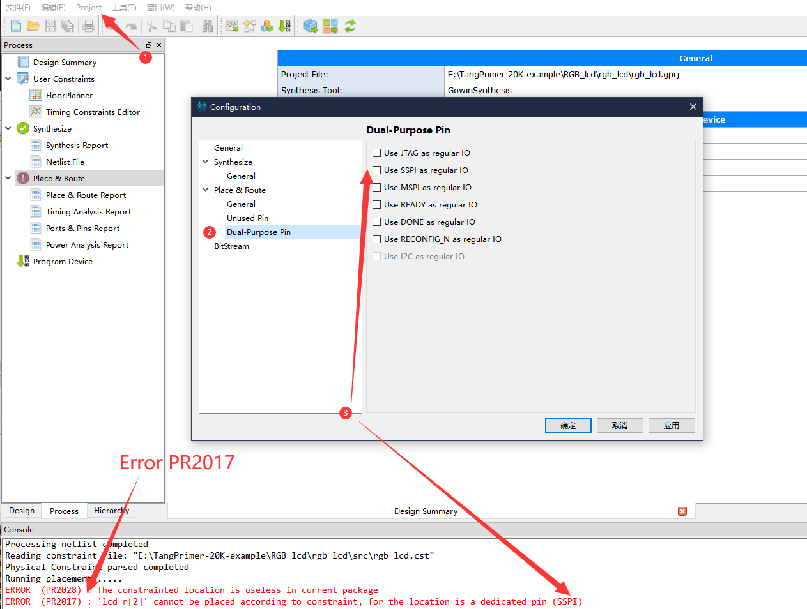

# TangNano-1K-examples

TangNano-1K is the new ting FPGA board of GW1NZ-1 FPGA.   

Orignal TangNano is based on GW1N-1 FPGA, refer to: https://github.com/sipeed/Tang-Nano-examples

TangNano-1K have independent 27M oscillator for FPGA, and remove the psram chip(but keep the pad), use BL702 for programmer FPGA, refer to https://github.com/sipeed/RV-Debugger-BL702

## Examples

1. RGB led

Builk board led.

Burn the `led_pjt.fs` into Tang Nano 1K to check your projuct.

2. RGB LCD

Drive the RGB 40pin lcd screen.

Burn the `lcd_pjt.fs` into Tang Nano 1K to check your projuct.

## Questions

### Error code:RP2017

When you meet error code `PR2017`, just enable corresponding IO as regular IO.

Click `Project` in top menu bar and choose `Configuration`, then enable the corresponding Dual Purpose Pin to deal with this error.